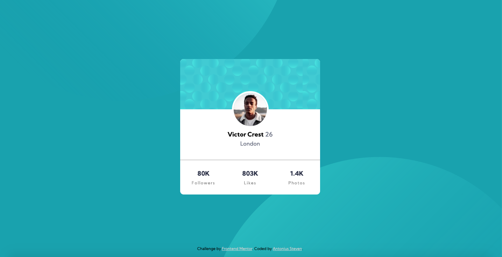

# Frontend Mentor - Profile card component solution

This is a solution to the [Profile card component challenge on Frontend Mentor](https://www.frontendmentor.io/challenges/profile-card-component-cfArpWshJ). Frontend Mentor challenges help you improve your coding skills by building realistic projects.

## Table of contents

- [Overview](#overview)
  - [The challenge](#the-challenge)
  - [Screenshot](#screenshot)
  - [Links](#links)
- [My process](#my-process)
  - [Built with](#built-with)
  - [What I learned](#what-i-learned)
  - [Continued development](#continued-development)
  - [Useful resources](#useful-resources)
- [Author](#author)

## Overview

### The challenge

- Build out the project to the designs provided

### Screenshot

### Links

- Solution URL: [Solution](https://github.com/ASteven21/Profile-Card)
- Live Site URL: [Live Web](https://asteven21.github.io/Profile-Card/)

## My process

### Built with

- Semantic HTML5 markup
- CSS custom properties
- Flexbox
- Mobile-first workflow

### What I learned

- I learned that you can actually have 2 values for the background-image property.

### Continued development

- Based from this challenge, I'm hoping to get better at the background image part since I find it tough to get them in its proper place in terms of responsiveness.

### Useful resources

- [@VitorBomaro](https://www.frontendmentor.io/solutions/sass-and-flexbox-mCPOL6w9M) - I knew about the 2 values in the background-image property from this person's code.

## Author

- Website - [GitHub](https://github.com/ASteven21)
- Frontend Mentor - [@ASteven21](https://www.frontendmentor.io/profile/ASteven21)
